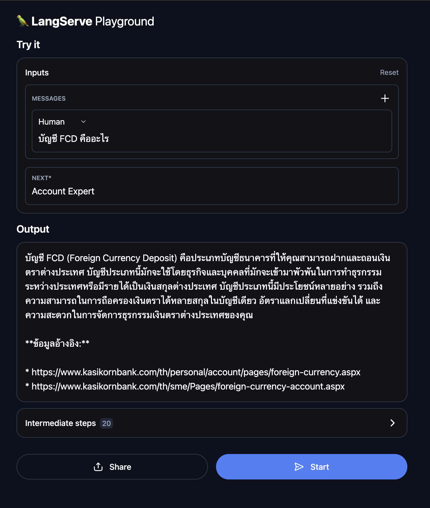

# athena-mind-adapter

The athena-mind-adapter project is designed to provide agent services to enable conversational scenarios for various of use-cases.

## Overview

### Objective
   The primary objective of the athena-mind-adapter project is to serve an agent to handle a specific task or multiple agent services for handling multiple use-cases.

### Key Features
- **Versatile Adapter Support for Multiple Use Cases**: 
    - Ready-to-use RAG template to quickly set up a pre-defined RAG with your documents
    - Fully customizable using Langchain for more complex processes
- **Ease of Deployment**: Integrates with DevOps API for streamlined deployment processes using Makefile and Docker Compose.
- **Custom Configuration**: Provides extensive configuration options for logging, and message queue (MQ)

## Getting Started

### Prerequisites

- Python Version
    
    Ensure you have Python 3.10 installed. You can download it from the [official Python website](https://www.python.org/downloads/).

- pip

    pip is the package installer for Python and is included with Python 3.10. To verify if pip is installed, you can run the following command:

    ```bash
    pip --version
    ```

    If pip is not installed, you can install it by following the official [pip installation guide](https://pip.pypa.io/en/stable/installation/).

- Kafka Cluster

    A running Kafka cluster is required for message queuing.
    Also ensure that you have aligned the Kafka server address and the necessary configuration details in the .env file to connect to the Kafka cluster.

- MongoDB

    A running mongo db is required for keeping collection of data.
    Also ensure that you have aligned the MongoDB server address, username and password in the .env file.

- Opensearch

    A running opensearch is required for keeping vector of data.
    Also ensure that you have aligned the opensearch server address in the .env file.

- athena-mind-llm

    A running athena-mind-llm is required for sending message to LLM and receive generated response.

- athena-mind-vector

    A running athena-mind-vector is required for create vectors that represent text.

### Installation

1. Open the Terminal 
2. Navigate to the Root Directory
3. (Optional) Create a Python Virtual Environment
    ```
    python -m venv venv
    ```
4. (Optional) Activate the Virtual Environment
    - For MacOS or Linux
        ```
        source venv/bin/activate
        ```
    - For Windows
        ```
        .\venv\Scripts\activate
        ```
5. Install Project Dependencies
    ```
    make app-install
    ```

### Run Project Locally ([Installation Required](#installation))

1. Open the Terminal 
2. Navigate to the Root Directory
3. (Optional) Activate the Virtual Environment
    - For MacOS or Linux
        ```
        source venv/bin/activate
        ```
    - For Windows
        ```
        .\venv\Scripts\activate
        ```
4. Run Project
    ```
    make app-start
    ```

### Run Unit Tests Locally ([Installation Required](#installation))

1. Open the Terminal 
2. Navigate to the Root Directory
3. (Optional) Activate the Virtual Environment
    - For MacOS or Linux
        ```
        source venv/bin/activate
        ```
    - For Windows
        ```
        .\venv\Scripts\activate
        ```
4. Run Unit Tests
    ```
    make app-test
    ```


## Development

1. **Environment Configuration**

    To configure the environment for the athena-mind-adapter service, follow these steps:

    - **Edit the .env File**
    
        Open the .env file located in the root directory of the project. This file contains various environment variables that need to be set according to your specific configuration requirements. 

        Most environment variables in the .env file are predefined with default values. However, some values may need adjustment based on your specific setup. For instance, the MQ_CLIENT_HOST might need to be updated to match your Kafka server's address.
    
    - **Configuration Details**

        The .env file requires configuration for the following components:

        - **Logging**: Define the logging level and timezone.
        
        - **Message Queue (MQ)**: Configure settings for Kafka, including the host, consumer group ID, and topics.
        
        - **MongoDB**: Configure settings for MongoDB, including the host, user, and password.

        - **Opensearch**: Configure host for opensearch.

        - **Tracing & Metrics (Optional)**: Configure enabling for opentelemetry, including the host.

        - **Adapter configuration**: Set the path to adapter JSON configuration file.

2. **Running the Application**
    - Run with Makefile: Follow this [instruction](#run-project-locally-installation-required)
    
    - Run with Docker Compose: 
        1. Open the Terminal 
        2. Navigate to the Root Directory
        3. Run Docker Compose
            ```
            docker compose up --build -d
            ```
3. **Try using Adapter with the LangServe Playground**
    
    Navigate to `http://localhost:8900/api/v1/chain/{ADAPTER}/playground/`, replacing `{ADAPTER}` with name of your adapter.

    **Example**: [http://localhost:8900/api/v1/chain/web_account/playground/](http://localhost:8900/api/v1/chain/web_account/playground/)

    

## Creating an Adapter using Predefined RAG

To create a new adapter using a predefined RAG template, follow these steps:

1. Add your new adapter configuration with type `rag` in [data/config.json](data/config.json) or in your specified path.
    
    **Example**: Adding an adapter to handle bank account inquiries, as shown in the example below.
    ```json
    [
        {
            "adapter": "web_account",
            "name": "Account Expert",
            "role": "Answer the question about four accounts: FCD (Foreign Currency Deposit), K-eSaving and other types of accounts",
            "type": "rag",
            "host": "service-adapter:8900",
            "config": {
                "dataset_path": "data/web_account/data/all_data.jsonl",
                "dataset_doc_id": "doc_id",
                "mongo_db_name": "athena-web-account",
                "mongo_collection_name": "testing",
                "opensearch_index": "athena-web-account",
                "prompt": {
                    "dir": "data/web_account/prompt",
                    "query_generate_prompt": "query_generation_prompt.txt",
                    "qa_prompt": "qa_prompt.txt",
                    "response_control_prompt": "rc_prompt.txt"
                }
            }
        }
    ]
    ```

    These configurations will be described with the following details.

    * __adapter__ - must be the name of folder inside `data` folder.
    * __name__ - name of adapter
    * __role__ - short description about role of chatbot 
    * __type__ - there are two types: `rag` and `custom`
    * __host__ - adapter endpoint
    * __config__
        * dataset_path - path to refer your dataset
        * dataset_doc_id - document key name
        * mongo_db_name - name of db in mongo
        * mongo_collection_name - name of collection in mongo
        * opensearch_index - name of index in opensearch
        * prompt
            * dir - directory that store prompt
            * query_generate_prompt - file name of prompt for query generation
            * qa_prompt - file name of prompt for question and answer prompt
            * response_control_prompt - file name of prompt for response control

2. For the predefined RAG template, you must provide three types of prompts, each with its file path specified in the adapter configuration:

    1. [query_generate_prompt](data/web_account/prompt/query_generation_prompt.txt): for query generation.

        **Example**:
        ```
        Given a chat history and the latest user question which might reference context in the chat history, formulate a standalone question which can be understood without the chat history. Do NOT answer the question, just reformulate it if needed and otherwise return it as is.
        ```

    2. [qa_prompt](data/web_account/prompt/qa_prompt.txt): for asking question and retrieving answer.

        **Example**:
        ```
        You are an Expert Customer Support working for Kasikorn Bank.
        Your customer is asking a question: <question>$query</question>
        Your co-worker have read the question, search for the internal relavant documents and found these documents:
        <documents>
        {context}
        </documents>
        Your task is to answer customer's question based on the searched documents and also provide the references (URL).
        Answer in English only, the translator will do the personalization for you afterwards.
        ```

    3. [response_control_prompt](data/web_account/prompt/rc_prompt.txt): for agent persona control and translation.

        **Example**:
        ```
        You are a polite Thai Girl working as an Engligh-Thai Translator.
        Your task is to translate the given text in English into Thai.
        Translate from English to Thai only, adding anything is prohibited.
        If the text is already in Thai, you ignore your task and give the exact same answer.
        Soften and force-word into able-word, for example, ต้อง -> สามารถ.

        Text: {answer}
        ```


## Creating your Customized Adapter
    
To create custom adapter by utilizing Langchain for specific use case, follow these steps:

1. Add your new adapter configuration with type `custom` in [data/config.json](data/config.json) or in your specified path.

    **Example**: Adding a custom adapter to handle general inquiries, as shown in the example below.

    ```json
    [
        {
            "adapter": "general_handler",
            "name": "General Handler",
            "role": "Answer any questions about others",
            "type": "custom",
        }
    ]
    ```

2. Create a Python file with the same name as the adapter specified in the `adapter` field of the JSON configuration file. Place this file inside the [src/custom_chain](src/custom_chain) folder.
3. Inside the file, create a function named `get_chain` that takes `llm` as a parameter and returns the `custom chain`.

    ```python
    def get_chain(llm):
        # customize your code by utilizing Langchain for your use-case.
        return chain
    ```

    **Example**: [general_handler](src/custom_chain/general_handler.py) adapter
    ```python
    def get_chain(llm):
        prompt = ChatPromptTemplate.from_messages(
            [
                (
                    "system",
                    "You are a helpful assistant. Answer all questions to the best of your ability.",
                ),
                MessagesPlaceholder("messages")
            ]
        )
        output_parser = StrOutputParser()
        chain = prompt | llm | output_parser
    return chain
    ```

## Project Structure
```bash
athena-mind-adapter
├── data
├── deployments
├── lib
│   ├── mq_client
├── scripts
├── src
│   ├── client
│   ├── common
│   ├── custom_chain
│   ├── embeddings
│   ├── language_models
│   ├── rag
│   ├── tests
│   └── main.py
├── .env
├── .python-version
├── docker-compose.yml
├── Dockerfile
├── makefile
├── requirement-dev.txt
└── requirement.txt
```

### Description

- **data**: Contains adapter configuration, prompt and data.
- **deployments**: Contains required service docker-compose files for development.
- **lib**: Internal Library directory.
    - **mq_client**: Message queue client library.
- **src**: Source code directory.
    - **client**: Contains the code to start the service.
    - **common**: Includes common components.
    - **custom_chain**: Contains customize agent for specific use-case.
    - **embeddings**: Implementations of embeddings service.
    - **language_models**: Implementations of LLM service.
    - **rag**: Implementations of RAG agent service.
    - **tests**: Contains unit test files for testing the code.
- **main.py**: The main entry point to start the service.
- **.env**: Environment variables configuration file.
- **.python-version**: Specifies the Python version used for the project.
- **docker-compose.yml**: docker-compose file to deploy the application for development.
- **Dockerfile**: Docker configuration file for containerizing the application.
- **Makefile**: Encapsulated commands to run the service on the terminal.
- **requirements-dev.txt**: Dependencies required in the development environment (e.g., unit testing dependencies).
- **requirements.txt**: Project dependencies required for running the application.